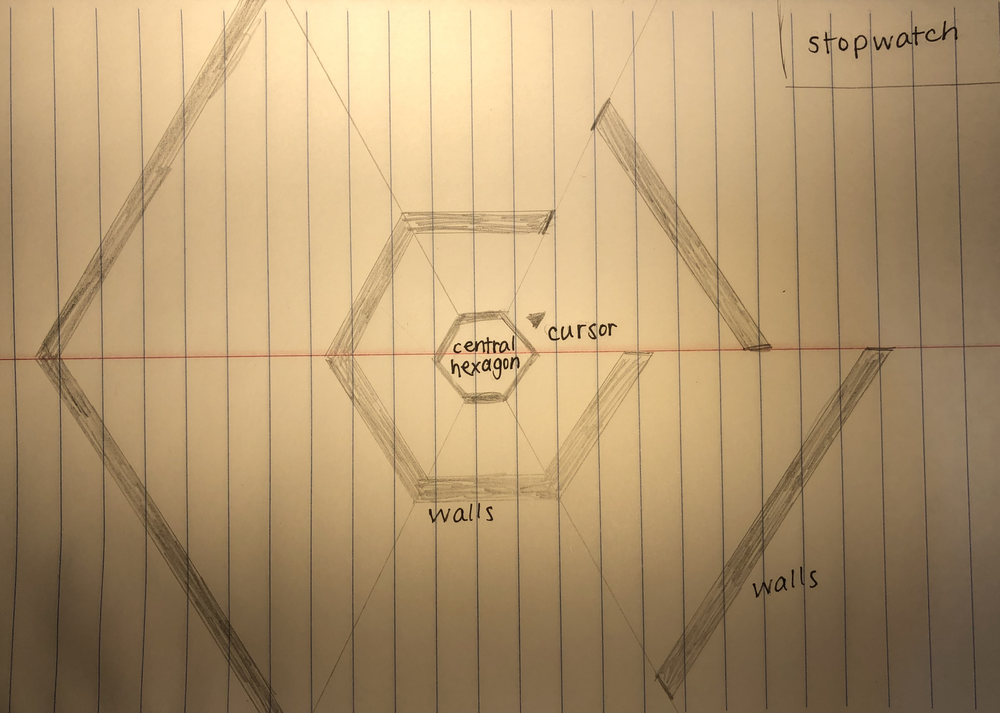

# Wicked Hexagon

## Background and Overview
[Wicked Hexagon](https://tchin8.github.io/) is a Javascript clone of [Super Hexagon](https://superhexagon.com/). Wicked Hexagon is a simple, fast-paced game that features a user-controlled cursor that pivots around a hexagon, while avoiding incoming walls. 

Check it out [here](https://tchin8.github.io/)!

## Functionality and MVPs
- Players can press space to pause and play the game.
- Players can use left/right arrow keys to pivot the cursor around the central hexagon.
  - Available option to use A/D keys for left-handed players.
- Random walls will enclose the user, who must avoid the incoming walls.
- A stopwatch in the upper right corner will keep track of how long the player has survived.

## Wireframe
Incoming walls appear from the sides of the canvas to meet the walls of the central hexagon. The player controls the cursor, which pivots around the central hexagon. To survive, the cursor cannot touch any of the incoming walls.

## Architecture and Technology
- JavaScript for game logic
- HTML5 Canvas for rendering
- Webpack to bundle scripts

## Implementation Timeline 
### Day 1
- Begin writing general game logic.
- Review the use of canvas for animation and rendering.
- Render central hexagon and cursor.
### Day 2
- Render stopwatch.
- Implement user control (space key) to pause and stop the game.
### Day 3
- Implement user controls (A/D or left/right arrows) to pivot the cursor.
- Implement canvas rotation.
- Render random walls.
### Day 4
- Complete all game logic.
  - Players lose when a wall touches the cursor.
- Implement sounds and background music.

## Bonus Features
- Levels
  - As the game progresses, the canvas may pulsate, change shape and/or direction.
- Scoreboard
  - Players can keep track of their longest plays.