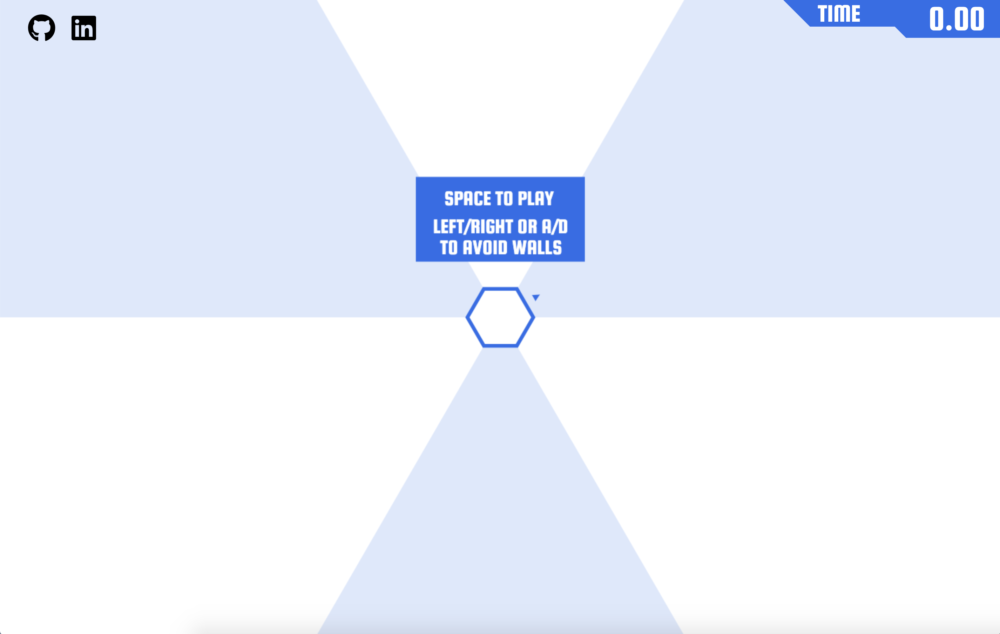

# Wicked Hexagon

## Background and Overview
[Wicked Hexagon](https://tchin8.github.io/Wicked-Hexagon/) is a Javascript clone of [Super Hexagon](https://superhexagon.com/). Wicked Hexagon is a simple, fast-paced game that features a user-controlled cursor that pivots around a hexagon, while avoiding incoming walls. 

Check it out [here](https://tchin8.github.io/Wicked-Hexagon/)!



## Technologies
- JavaScript for game logic
- HTML5 Canvas for rendering
- Webpack to bundle scripts

## Features
**1. Players can press space to pause and play the game.**

**2. Players can use left/right arrow keys to pivot the cursor around the central hexagon.**
  - Available option to use A/D keys for left-handed players.

**3. Random walls will enclose the user, who must avoid the incoming walls.**


**4. A stopwatch in the upper right corner will keep track of how long the player has survived.**

**5. Game will randomly change rotation direction and pulsate**


## Implementation Timeline 
### Day 1
- Begin writing general game logic.
- Review the use of canvas for animation and rendering.
- Render central hexagon and cursor.
### Day 2
- Render stopwatch.
- Implement user control (space key) to pause and stop the game.
### Day 3
- Implement user controls (A/D or left/right arrows) to pivot the cursor.
- Implement canvas rotation.
- Render random walls.
### Day 4
- Complete all game logic.
  - Players lose when a wall touches the cursor.
- Implement sounds and background music.
- Implement random rotation switch and pulsations.

## Code Snippets
In order to produce the pulse effect, `this.scale` is updated within `game.js` and implemented across all JS scripts that require size changes. These include the sizes of the central hexagon, incoming walls, and the cursor's revolution diameter.
```javascript 
// game.js

updateScale() {
  if (this.scale <= 1) {
    this.scaleDir = "increasing";
  } else if (this.scale >= 1.3) {
    this.scaleDir = "decreasing";
  }

  if (this.scaleDir === "increasing") {
    this.scale += 0.025;
  } else if (this.scaleDir === "decreasing") {
    this.scale -= 0.025;
  }
}
```

Below, the `scale` argument has been passed in when invoked within `/game.js`. This is factored into animating the walls as they pulsate and change in size. 
```javascript
// walls.js

animate(ctx, scale) {
  if (this.wallCombos.length !== 0 && this.wallCombos[this.wallCombos.length - 1].length % 7 === 0) {
    
    for (let i = 0; i < this.wallCombos.length; i++) {
      let walls = this.wallCombos[i];

      if (walls[0].length === 70) {
        this.wallCombos.unshift();
        continue;
      }

      let prevCoord;

      for (let j = 0; j < walls.length; j++) {
        let wall = walls[j];

        if (wall.isWall !== 'line') {
          this.animateWallAngle = this.animateWallAngle + 60;
        }

        if (this.animateWallAngle >= 360) {
          this.animateWallAngle = this.animateWallAngle % 360;
        }

        let x2, y2, ax, ay, bx, by, newLength;

        newLength = wall.length - 5;

        x2 = this.x + Math.cos(Math.PI * this.animateWallAngle / 180) * (newLength * scale);
        y2 = this.y + Math.sin(Math.PI * this.animateWallAngle / 180) * (newLength * scale);

        // tapezoid point on first line 
        bx = this.x + Math.cos(Math.PI * this.animateWallAngle / 180) * ((newLength * scale) - DEFAULTS.SIZE);
        by = this.y + Math.sin(Math.PI * this.animateWallAngle / 180) * ((newLength * scale) - DEFAULTS.SIZE);

        ctx.beginPath();
        ctx.moveTo(bx, by);
        ctx.lineTo(x2, y2);

        if (prevCoord !== undefined) {
          ctx.lineTo(...prevCoord);

          ax = prevCoord[0] + Math.cos(Math.PI * (this.animateWallAngle + 120) / 180) * DEFAULTS.SIZE;
          ay = prevCoord[1] + Math.sin(Math.PI * (this.animateWallAngle + 120) / 180) * DEFAULTS.SIZE;

          ctx.lineTo(ax, ay);
          ctx.lineTo(bx, by);
        }

        if (wall.isWall === true) {
          ctx.strokeStyle = DEFAULTS.COLORS[4][0];
          ctx.fillStyle = DEFAULTS.COLORS[4][0];
        } else if (wall.isWall === false) {
          ctx.strokeStyle = DEFAULTS.COLORS[4][1];
          ctx.fillStyle = DEFAULTS.COLORS[4][1];
        }

        ctx.fill();
        ctx.stroke();

        prevCoord = [x2, y2];

        this.wallCombos[i][j] = {
          length: newLength,
          isWall: wall.isWall,
          angle: this.animateWallAngle,
          point1: [ax, ay],
          point2: [bx, by],
        }
      }
    }
  }
}
```

## Future Direction
### Scoreboard
  - Players can keep track of their longest plays.
### Levels
  - Players can choose the difficulty of each play.
### Animated color transitions